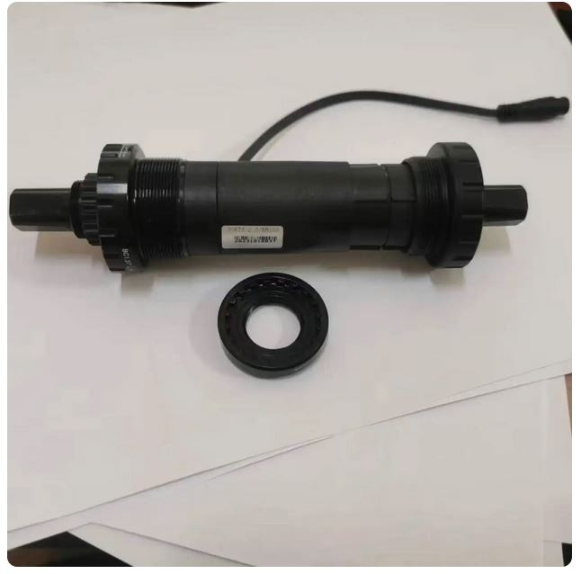
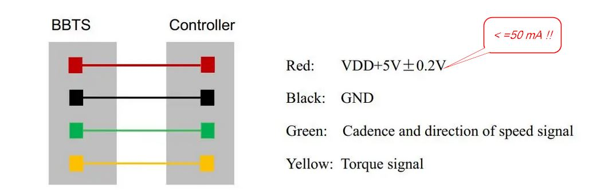
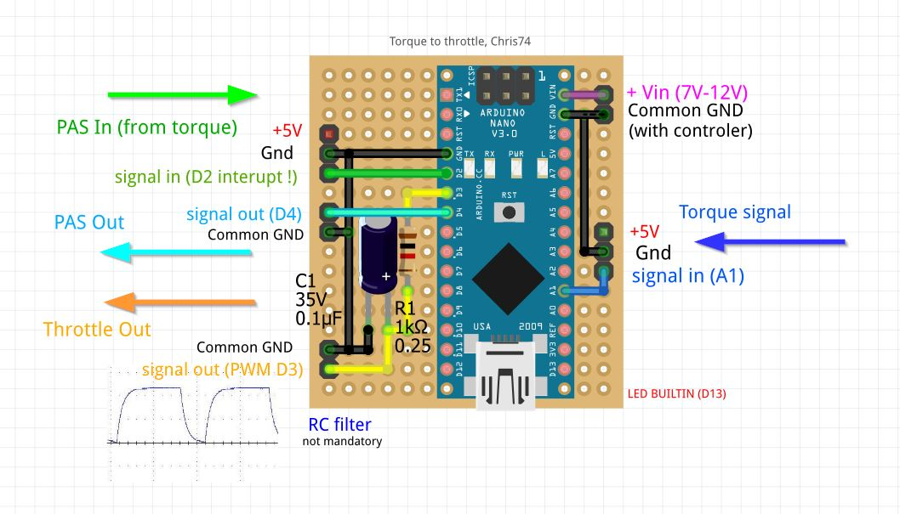
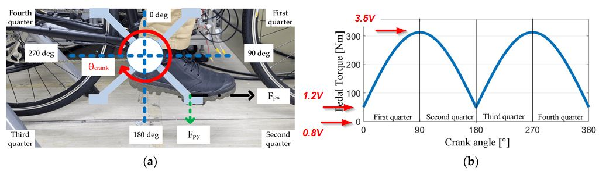
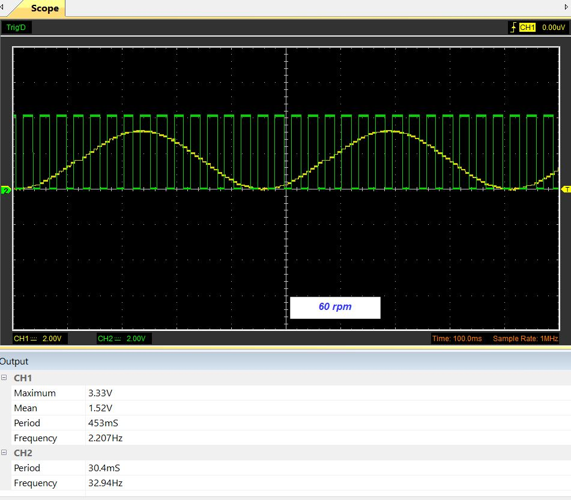
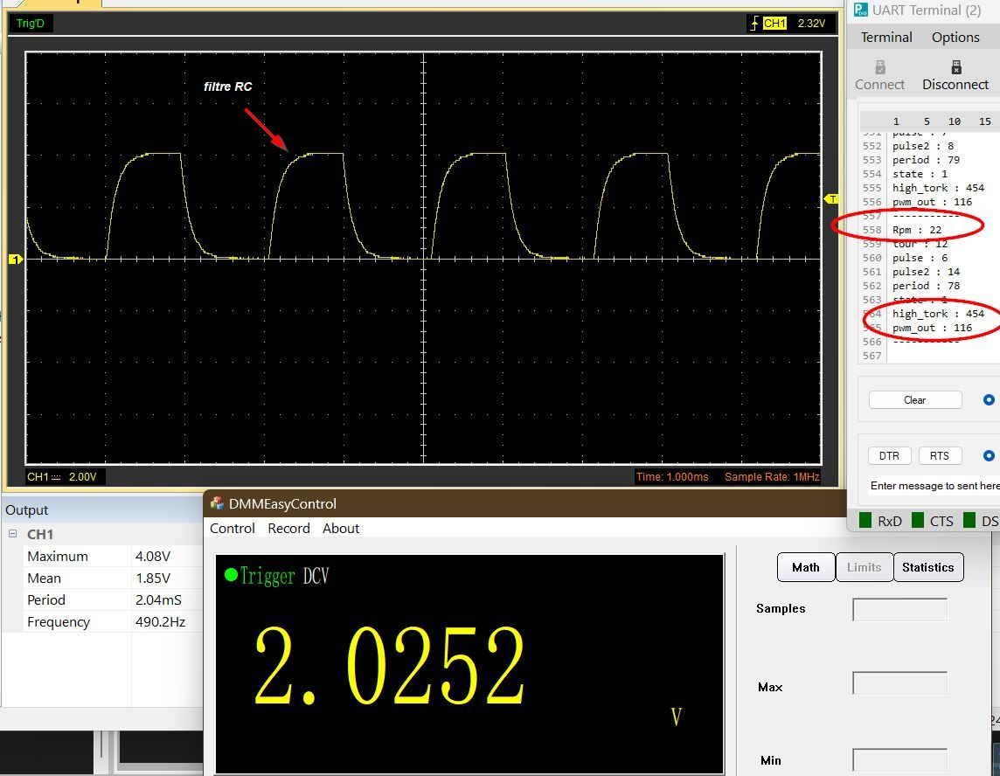

# e-bike torque to throttle, test

Discussion en français sur le [forum Cyclurba](https://cyclurba.fr/forum/751958/arduino-l-assistance-d-un-vae.html?from=221&discussionID=31032&messageID=751958)  

### Torque sensor   
marque AXLETORQUEBB68MM (Aliexpress)
5V 50mA MAX, 35mA standard, sortie 0.8-3.7v, 44mV/Nm, 75 Nm max  

  

### sensor pin out  

  

### Diagram Arduino Nano

  

### Torque diagram
[Source, voir son pdf](https://www.mdpi.com/1424-8220/23/10/4657 " voir son pdf")  

    

  
### Mon générateur de signal ebike  

  

### signal PWM OUT
filtre RC comme sur schéma, vérification sur oscillo + voltmètre de labo  

  

